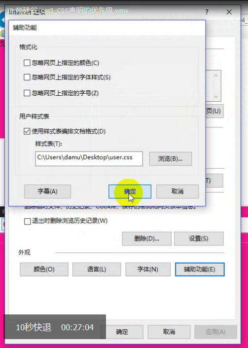

###CSS选择器
	CSS3选择器规范地址：	   https://www.w3.org/TR/2011/REC-css3-selectors-20110929/
	CSS3选择最新选择器规范:  https://www.w3.org/TR/selectors  
	
	!---问题---!
		1.css的全称是什么？
		2.样式表的组成
		3.浏览器读取编译css的顺序？
	
	1.基本选择器
		/*通配符选择器*/		* { margin: 0; padding: 0; border: none; }
		/*元素选择器*/		body { background: #eee; }
		/*类选择器*/		.list { list-style: square; }
		/*ID选择器*/		#list { width: 500px; margin: 0 auto; }
		/*后代选择器*/		.list li { margin-top: 10px; background: #abcdef; }

​	
	2.基本选择器扩展
		/*子元素选择器*/		#wrap > .inner {color: pink;}
					也可称为直接后代选择器,此类选择器只能匹配到直接后代，不能匹配到深层次的后代元素
		/*相邻兄弟选择器*/	#wrap #first + .inner {color: #f00;}
					它只会匹配紧跟着的兄弟元素
		/*通用兄弟选择器*/	#wrap #first ~ div { border: 1px solid;}
					它会匹配所有的兄弟元素(不需要紧跟)
		/*选择器分组*/		h1,h2,h3{color: pink;}  
					此处的逗号我们称之为结合符

​	
	3.属性选择器
		/*存在和值属性选择器*/	
			[attr]：该选择器选择包含 attr 属性的所有元素，不论 attr 的值为何。
			[attr=val]：该选择器仅选择 attr 属性被赋值为 val 的所有元素。
			[attr~=val]：表示带有以 attr 命名的属性的元素，并且该属性是一个以空格作为分隔的值列表，其中至少一个值为val。
		
		/*子串值属性选择器*/
			 [attr|=val] : 选择attr属性的值是val（包括val）或以val-开头的元素。
			 [attr^=val] : 选择attr属性的值以val开头（包括val）的元素。
			 [attr$=val] : 选择attr属性的值以val结尾（包括val）的元素。
			 [attr*=val] : 选择attr属性的值中包含字符串val的元素。

​	
	4.伪类与伪元素选择器
		/*链接伪类*/		注意:link，:visited，:target是作用于链接元素的！
				:link		表示作为超链接，并指向一个未访问的地址的所有锚
				:visited	表示作为超链接，并指向一个已访问的地址的所有锚
				:target 	代表一个特殊的元素，它的id是URI的片段标识符
		/*动态伪类*/		注意:hover，:active基本可以作用于所有的元素！
				:hover		表示悬浮到元素上
				:active		表示匹配被用户激活的元素（点击按住时）
				
				由于a标签的:link和:visited可以覆盖了所有a标签的状态，所以当:link，:visited，:hover，:active同时出现在a标签
				身上时 :link和:visited不能放在最后！！！
				
				隐私与:visited选择器
					只有下列的属性才能被应用到已访问链接：
						color
						background-color
						border-color
		/*表单相关伪类*/
				:enabled	匹配可编辑的表单
				:disable	匹配被禁用的表单
				:checked	匹配被选中的表单
				:focus		匹配获焦的表单
				
		/*结构性伪类*/
				index的值从1开始计数！！！！
				index可以为变量n(只能是n)
				index可以为even odd
					#wrap ele:nth-child(index)		表示匹配#wrap中第index的子元素 这个子元素必须是ele
					#wrap ele:nth-of-type(index)	表示匹配#wrap中第index的ele子元素
					除此之外:nth-child和:nth-of-type有一个很重要的区别！！
							nth-of-type以元素为中心！！！
							
				:nth-child(index)系列			
					:first-child
					:last-child
					:nth-last-child(index)
					:only-child	(相对于:first-child:last-child 或者 :nth-child(1):nth-last-child(1))
				:nth-of-type(index)系列
					:first-of-type
					:last-of-type
					:nth-last-type(index)
					:only-of-type	(相对于:first-of-type:last-of-type 或者 :nth-of-type(1):nth-last-of-type(1))
					
				:not		
				:empty(内容必须是空的，有空格都不行，有attr没关系)
		/*伪元素*/
				::after
				::before
				::firstLetter
				::firstLine
				::selection

​	
	5.css声明的优先级
		选择器的特殊性(通过特殊性来判断冲突样式的应用规则)
			选择器的特殊性由选择器本身的组件确定，这里将特殊性值表述为4个部分，如0,0,0,0
			一个选择器的具体特殊性如下确定：
			       1.对于选择器中给定的ID属性值，加 0,1,0,0
			       2.对于选择器中给定的各个类属性，属性选择，或伪类，加 0,0,1,0
			       3.对于选择器中的给定的各个元素和伪元素，加0,0,0,1
			       4.通配符选择器的特殊性为0,0,0,0
			       5.结合符对选择器特殊性没有一点贡献
			       6.内联声明的特殊性都是1,0,0,0
			       7.继承没有特殊性
	 
				特殊性 1,0,0,0 大于所有以0开头的特殊性(不进位) 
				对于不进位的说明：
				比如有10个ID属性
				#12#12#12#12#12#12#12#12#12#12{。。。。}
				其对应的特殊性为0 10 00
				
				选择器的特殊性最终都会授予给其对应的声明
				如果多个规则与同一个元素匹配，而且有些声明互相冲突时，特殊性越大的越占优势
	 
				实例：id选择器和属性选择器
				      div[id="test"]（0,0,1,1） 和 #test（0,1,0,0） ，当这两个选择器同时作用于一个元素时且样式有冲突时，
					  0100大于0011的特殊性，因此会应用0100的样式
		重要声明（!important来标注）
			有时某个声明比较重要，超过了所有其他声明，css2.1就称之为重要声明
			并允许在这些声明的结束分号之前插入  !important  来标志
			必须要准确的放置  !important 否则声明无效。 
			!important 总是要放在声明的最后，即分号的前面
			 
			 标志为 !important的声明并没有特殊的特殊性值，不过要与非重要声明分开考虑。
			 实际上所有的重要声明会被浏览器分为一组，冲突通过其特殊性来解决
			 非重要声明也会被分为一组，冲突通过其特殊性来解决
			 如果一个重要声明与非重要声明冲突，胜出的总是重要声明
		继承
			继承没有特殊性，继承过来的模式甚至连0特殊性都没有
			0特殊性（比如文档开始时候的*通配符描述的样式）要比无特殊性来的强
		来源
			css样式的来源大致有三种
			  创作人员
			  读者（只有IE浏览器提供了相关方式，其它的都没有提供，具体看下文图一）
			  用户代理   
			 
			权重：
			   读者的重要声明
			   创作人员的重要声明
			   创作人员的正常声明
			   读者的正常声明
			   用户代理的声明
		层叠
			1.找出所有相关的规则，这些规则都包含一个选择器
		    2.计算声明的优先级
		               先按来源排序
		               在按选择器的特殊性排序
		               最终按顺序

图一：

