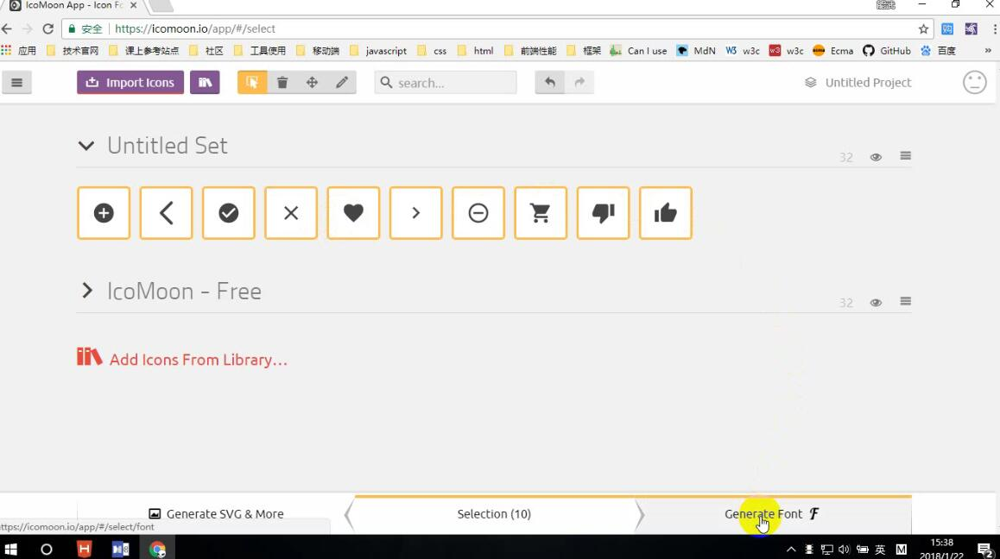

# 一、自定义字体

**定义：**

@font-face:允许网页开发者为其网页指定在线字体。 通过这种作者自备字体的方式，可以消除对用户电脑字体的依赖，属性如下：

- font-family 所指定的字体名字将会被用于font或font-family属性
- src字体资源

便于统一字体，将自定义字体放在服务器上，所有的客户端都可以从服务器上下载。

否则的话只能使用客户本地有的字体，但操作系统的字体库是不一样的，容易出现字体不一致的问题

**使用：**

```css
@font-face {
				font-family:"damu";
				src: url(damu/GOUDYSTO.TTF);
			}
```

> src: url(damu/GOUDYSTO.TTF);指定自定义字体的相对路径，可以将字体文件TTF放到服务器的某个地方，在这里引用
> **注意:不能在一个 CSS 选择器中定义 @font-face**

# 二、字体图标

在自定义自体基础上延伸出来的一项技术。

**应用：**

淘宝上的一些矢量图使用的就是自定义字体，只不过是扩展了，使用的是字体图标。

使用的工具：

- AI:Adobe illustrator

  AI是一种应用于出版、多媒体和在线图像的工业标准矢量插画的软件，是一款非常好的矢量图形处理工具。该软件主要应用于印刷出版、海报书籍排版、专业插画、多媒体图像处理和互联网页面的制作等，也可以为线稿提供较高的精度和控制，适合生产任何小型设计到大型的复杂项目.

- FontLab

  FontLab是一个专业级的字体编辑软件，广泛应用于字体 设计人员和排版印刷业等专业场合。它能够对已有的字体进行修改，也可以完全按照要求 重新设计需要的字体。

  ```
  字体兼容处理网站
     https://www.fontsquirrel.com/tools/webfont-generator
  icomoon字体图标
     https://icomoon.io/#home
  ```

**字体图标的设计思路：**

1. 设计一套矢量图使用AI

2. 将不同的矢量图绑定到不同的字符上生成自定义字体，使用FontLab，生成字体文件TFF

3. 一般通过工具或者站点，将自定义字体文件TFF进行兼容性处理，将生成相关CSS样式(如以下网站会根据TFF生成用于网页字体文件css样式文件等)。

   ```properties
   字体兼容处理网站
   https://www.fontsquirrel.com/tools/webfont-generator
   ```

4. 在页面中使用上面生成的文件。

**字体图标的设计思路二：**

以上方法做出来的字体图标是比较丑的，使用另外一个网站来做：

1、拿到SVG(相关图标的矢量图)。

2、到iconmoon字体图标制作网站上使用SVG生成，字体图标。(内部就是与上面的思路一样将每一张矢量图与一个字符进行了绑定)



3、生成字体后会下载一个压缩包，解压后拷到项目中，其中有自定义字体CSS样式和demo

4、根据demo在页面中使用就行。

5、也可以使用现成的：

- 上面的  icomoon
- www.iconfont.cn，阿里巴巴的字体图标库


@font-face
	字体图标
		1.制作一套矢量图
		2.将矢量图与字符进行绑定
		3.使用工具或者站点生成一套字体
		4.最终使用
	 字体兼容处理网站
       https://www.fontsquirrel.com/tools/webfont-generator
    icomoon字体图标
       https://icomoon.io/#home


# 三、CSS3新增UI样式

看代码就行。无需笔记。

其中：

​	怎么实现溢出显示省略号？

​		white-space=no-wrap
​		overflow=hidden
​		text-overflow=ellipsis
​		包裹区域必须不能让子元素撑开