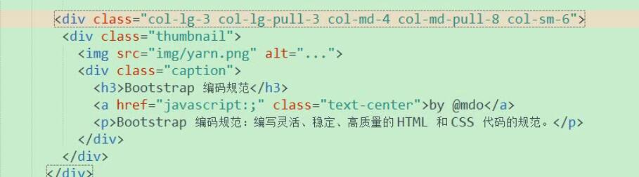

### bootstrap

在页面使用时：先定义容器，然后在容器中定义栅格。

​	简洁、直观、强悍的前端开发框架，让web开发更迅速、简单
​	中文网 ： http://www.bootcss.com/
​	英文网  :  http://getbootstrap.com/
​	

### 容器

​	流体布局容器
​		容器的width为auto，只是两边加了15px的padding。
​	

	固定布局
		容器的width会随设备分辨率的不同而生产变化
			分辨率阈值
				w >=1200	 		容器的width为1170   左右padding为15 （注意是borderBox）
				1200>w >=992		容器的width为970     左右padding为15 （注意是borderBox）
				992 > w >=768		容器的width为750     左右padding为15  （注意是borderBox）
				768 > w >=992		容器的width为auto    左右padding为15  （注意是borderBox）


以下是看栅格系统的源码分析也来的，可以再看一下视频。看栅格源码的时候其精髓就是使用less及递归调用mix in。

### 栅格系统（每一行分为12分）

​	 col-lg-x    
​	 col-md-x
​	 col-sm-x
​	 col-xs-x
​	 x默认拥有12个等级
​	 

### 列偏移（用于控制在每一份中的margin-left）用于微调

​	调整的是margin-left，分13个等级（0到12）
​			0时为0%
​	

### 列排序（用于控制元素在12份中的哪个位置，实际上是通过left或者right也就是开始位置是在12分之几的位置）

​	push的时候调整的是left，分13个等级（0到12）
​			0时为auto
​			

	pull的时候调整的是right，分13个等级（0到12）
			0时为auto

对列排序的理解：

在视频中有这么一个需求：

将原本如下显示的元素在html，dom中的顺序颠倒，但仍然按这个顺序显示：


也就是说原来在html中是bootstrp\yarn\react\webpack这样的顺序来定义的，当然显示顺序也是这样的，现在要改成

webpack\react\yarn\bootstrap这个的html顺序，但是显示仍然按上面的来，这里就可以使用列排序：

如下图：



下面的是将html中最后一个bootstrap调整到了第一个显示：

主要是下面这一句代码：

```html
<div class="col-lg-3 col-lg-pull-3 col-md-4 col-md-pull-8">
说明：其中col-lg-x，col-md-x是用于栅格的布局。
     col-lg-pull-3指的是在lg下div的right为3/12（最终是百分比），也就是在原来的位置基础上将其right拉到3/12%的位置上，也就是	   第一个的位置上，因为样例中一行有4个元素，每一个占3份。
     col-md-pull-4同上，将div在md的时候定位到4/12处也就是第一个
```


### 列偏移和列排序在源码中的输出样式

```css
.make-grid-columns()--->
		.col-xs-1, .col-sm-1, .col-md-1, .col-lg-1,
        .col-xs-2, .col-sm-2, .col-md-2, .col-lg-2,
        ...
        .col-xs-12, .col-sm-12, .col-md-12, .col-lg-12{
          position: relative;
          min-height: 1px;
          padding-left: 15px;
          padding-right: 15px;
        }
.make-grid(xs)--->
	  float-grid-columns(@class);
			 * .col-xs-1,.col-xs-2,.col-xs-3,.col-xs-4,...col-xs-12{
			 *     float: left;
			 * }
	  .loop-grid-columns(@grid-columns, @class, width);
	  		 * .col-xs-12{
			 *     width:12/12;
			 * }
			 * .col-xs-11{
			 *     width:11/12;
			 * }
			 * ...
			 * .col-xs-1{
			 *     width:1/12;
			 * } 
	  .loop-grid-columns(@grid-columns, @class, pull);
	  .loop-grid-columns(@grid-columns, @class, push);
	  		 *push                  pull:
			 * .col-xs-push-12{         .col-xs-pull-12{      
			 *     left:12/12;              right:12/12;
			 * }                        }
			 * .col-xs-push-11{
			 *     left:11/12;
			 * }
			 * ...                      ...
			 * .col-xs-push-1{
			 *     left:1/12;
			 * } 
			 * .col-xs-push-0{           .col-xs-pull-0{
			 *     left:auto;               right:auto;
			 * }                         }
			 
	  .loop-grid-columns(@grid-columns, @class, offset);
```


​	
   	


###响应式工具

###容器与栅格盒模型设计的精妙之处
		container 提供了一个15px的padding
		row 是 column 直接存在的容器，row 默认最多可有12个 column，
	同时作为都是左浮动的 column 的 wrapper，自带 clearfix 的性质。
	同时 row 还有一个很特殊的地方，就是左右各有 －15px 的 margin，
	为了抵消 container 中15px的 padding
		每个column 也会有15px的水平方向的 padding，colunmn 只能在 row 中生存，
	由于 row 的 margin 为－15px，那么位于两边的 column 就碰到了 container 的边界。
	但是 colunmn 本身又有 15px 的 padding 使得它其中的内容并不会碰到 container，
	同时 不同column的内容之间就有了30px的槽
	
	目的是为了确保列与列之间有30px的槽，列与容器之间有15px的槽


​				 
​			
​			
​	 
​				